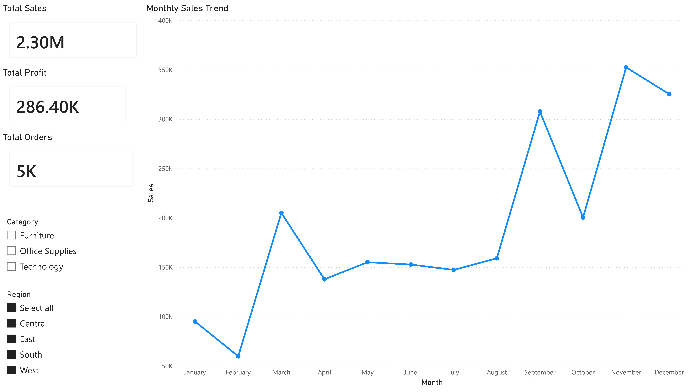
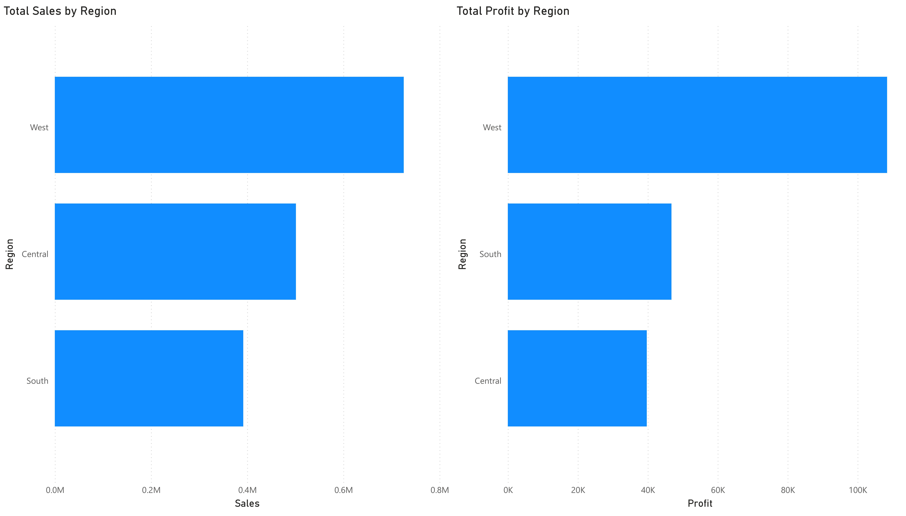
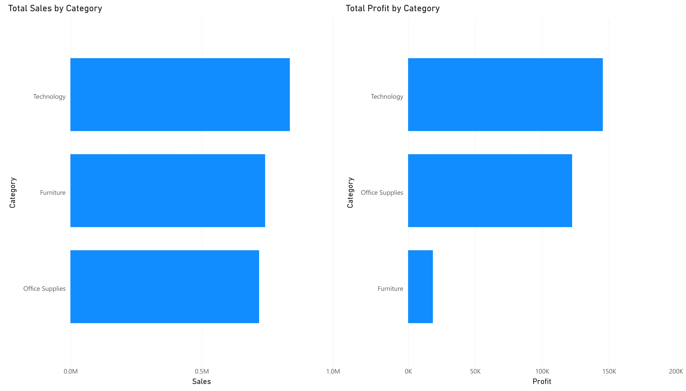

# Capstone — Retail Performance Analysis & Dashboard

<p align="left">
  
  
  
  
</p>

---

## Overview

This capstone project demonstrates a **complete retail sales analysis workflow**,
starting from a raw transactional dataset and ending with a **multi-page interactive
dashboard** designed for analytical review.

The project integrates multiple stages of analysis into a single, coherent workflow:

* scripted data cleaning and preparation
* validation and aggregation of key metrics
* structured dashboard design with interactive filtering
* clear separation of data, logic, and presentation

All steps are reproducible and documented, and the project can be reviewed without
executing any code.

---

## Objectives

* Transform raw retail sales data into an analysis-ready format
* Validate data quality and derive reusable summary tables
* Build a structured Power BI dashboard answering key business questions
* Maintain a clean and navigable repository structure
* Present results clearly for both technical and non-technical review

---

## Dataset Information

**Dataset Name:** Superstore Sales Dataset
**Source Platform:** Kaggle

<p align="left">
  <a href="https://www.kaggle.com/datasets/vivek468/superstore-dataset-final" target="_blank">
    
  </a>
</p>

The dataset contains transactional records from a retail superstore.

### Key Columns Used

| Column       | Description                     |
| ------------ | ------------------------------- |
| `Order Date` | Date when the order was placed  |
| `Ship Date`  | Date when the order was shipped |
| `Region`     | Sales region                    |
| `Category`   | Product category                |
| `Sales`      | Revenue generated               |
| `Profit`     | Profit from the transaction     |
| `Quantity`   | Units sold                      |
| `Discount`   | Discount applied                |

The raw dataset is preserved unchanged.
All transformations are performed through scripted workflows.

---

## Workflow Summary

The project follows a **sequential and repeatable workflow**:

1. **Raw Data Storage**

   * Original dataset stored in read-only form

2. **Data Cleaning (Python)**

   * Column standardization
   * Date parsing and type correction
   * Removal of invalid records
   * Creation of basic time features

3. **Validation & Aggregation**

   * Row-level validation
   * Generation of summary tables (region, category, month)

4. **Dashboard Development**

   * Multi-page Power BI report
   * Interactive slicers shared across pages
   * Clear comparison-focused visuals

5. **Output Packaging**

   * Dashboard screenshots
   * Reproducible scripts
   * Structured documentation

Each step is isolated so that changes in one stage do not affect others.

---

## Project Structure

All paths are relative to the **repository root**.

```
Capstone_Retail_Performance_Analysis/
├── dashboards/
│   ├── Retail_Performance_Dashboard.pbix
│   └── screenshots/
│       ├── category_performance.jpg
│       ├── overview.jpg
│       └── regional_performance.jpg
│
├── data/
│   ├── processed/
│   │   ├── summaries/
│   │   │   ├── summary_by_category.csv
│   │   │   ├── summary_by_month.csv
│   │   │   ├── summary_by_region.csv
│   │   │   └── summary_overall.csv
│   │   └── superstore_sales_cleaned.csv
│   └── raw/
│       └── superstore_sales_raw.csv
│
├── docs/
│   ├── assumptions.md
│   ├── limitations.md
│   └── methodology.md
│
├── scripts/
│   ├── data_cleaning.py
│   └── data_validation_and_summary.py
│
├── requirements.txt
└── README.md
```

### Folder & File Explanation

* **dashboards/**
  Power BI report file and static screenshots for preview

* **data/raw/**
  Original dataset (never modified)

* **data/processed/**
  Cleaned dataset and derived summary tables

* **docs/**
  Written explanation of methodology, assumptions, and limitations

* **scripts/**
  Python scripts for cleaning, validation, and aggregation

* **requirements.txt**
  Python dependencies for reproducibility

---

## Dashboard Pages

### Overview

Purpose: High-level snapshot of retail performance

Includes:

* Total Sales
* Total Profit
* Total Orders
* Monthly Sales Trend
* Global filters (Region, Category)



---

### Regional Performance

Purpose: Compare performance across regions

Includes:

* Sales by Region
* Profit by Region



---

### Category Performance

Purpose: Evaluate product category contribution

Includes:

* Sales by Category
* Profit by Category



---

## Software & Tools

The project is designed to be reviewed and executed using widely available tools.
Dashboard interaction is recommended through **Power BI Web** for cross-platform compatibility.

### Required Software

- **Python 3.9 or newer**  
  Used for data cleaning, validation, and aggregation.

- **Power BI (Web — Recommended)**  
  Used for dashboard creation and interaction.  
  Power BI Web allows viewing and interacting with dashboards without installing
  desktop software and works across all operating systems.

- **Power BI Desktop (Optional)**  
  Required only if you want to open or modify the `.pbix` file locally.

- **Git**  
  Used for version control and repository management.

---

You’re right — thanks for catching it.
Below is the **correct, precise replacement** for that section, with **explicit capstone paths** and **root-level execution clarity**.

You can **replace the entire section** you pasted with the following.

---

## Installation & Execution (From Repository Root)

All commands below must be executed from the **repository root**:

```
data-analyst-internship-tasks/
```

The capstone project lives inside the unified internship repository under:

```
Capstone_Retail_Performance_Analysis/
```

---

### 1. Create Virtual Environment (Capstone-scoped)

Create the virtual environment **inside the capstone folder**, while staying in the repository root:

```bash
python -m venv Capstone_Retail_Performance_Analysis/.venv
```

Activate the environment:

* **Linux / macOS**

  ```bash
  source Capstone_Retail_Performance_Analysis/.venv/bin/activate
  ```

* **Windows**

  ```bash
  Capstone_Retail_Performance_Analysis\.venv\Scripts\activate
  ```

---

### 2. Install Dependencies

Install Python dependencies using the capstone-specific requirements file:

```bash
pip install -r Capstone_Retail_Performance_Analysis/requirements.txt
```

---

### 3. Run Data Pipeline

Execute the data preparation scripts using **explicit capstone paths**:

```bash
python Capstone_Retail_Performance_Analysis/scripts/data_cleaning.py
python Capstone_Retail_Performance_Analysis/scripts/data_validation_and_summary.py
```

These scripts will:

* read raw data from `Capstone_Retail_Performance_Analysis/data/raw/`
* generate cleaned and summary datasets under `data/processed/`

---

### 4. Open Dashboard

**Recommended (Cross-platform):**
Upload the cleaned CSV files or the Power BI report to **Power BI Web** and interact with the dashboard in the browser.

**Optional (Local):**
Open the following file in Power BI Desktop:

```
Capstone_Retail_Performance_Analysis/dashboards/Retail_Performance_Dashboard.pbix
```

---

This version now:

* removes ambiguity
* enforces root-level execution
* correctly scopes everything to the capstone folder
* matches your actual repository layout

If you want, next I can do a **final full README sanity check** (paths, wording, consistency) before you push.

---

## Key Outcomes

* End-to-end ownership of a retail data analysis workflow
* Scripted, reproducible data preparation
* Clear and structured multi-page dashboard
* Well-organized repository suitable for review and reuse

---

## Repository Context

This capstone project represents the **final and most comprehensive submission**
within the Data Analyst Internship repository.

Earlier tasks focus on individual skills.
This project integrates those skills into a single, complete analysis workflow.

---

## Author

**Athar Shaikh**
Data Analyst Intern  
Elevate Labs  